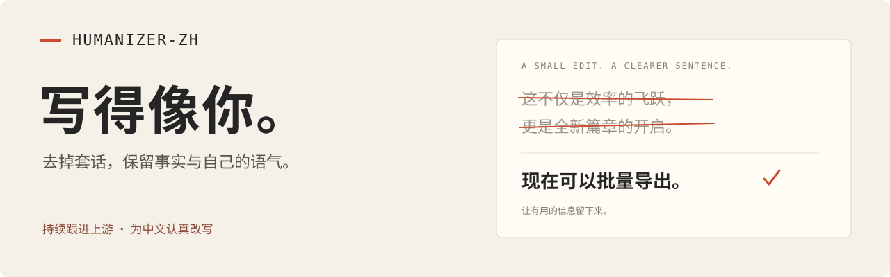

<p align="center">
  
</p>

<p align="center">
  <a href="LICENSE"></a>
  <a href=".github/workflows/validate.yml"></a>
  <a href="docs/UPSTREAM.md"></a>
  <a href="https://github.com/tonyyunyang/humanizer-zh/stargazers"></a>
</p>

<p align="center">
  <a href="#安装">安装</a> · <a href="#用起来">用法</a> · <a href="docs/UPSTREAM.md">上游同步</a> · <a href="CONTRIBUTING.md">参与贡献</a> · <a href="README.en.md">English</a>
</p>

# Humanizer-zh

去掉中文里的套话和模板感，保留事实，也保留你的语气。

Humanizer-zh 是一个中文写作 skill，适用于文章、邮件、工作同步和技术文档。**持续跟进 [Blader Humanizer](https://github.com/blader/humanizer)，把适合中文的经验认真改写进来。** 同时吸收[说人话](https://github.com/MrGeDiao/shuorenhua)的中文实践，参考[早期 Humanizer-zh](https://github.com/op7418/Humanizer-zh) 的整理。

核心只有一个 [SKILL.md](SKILL.md)。没有运行服务，不需要本项目的 API key；装进你已有的 AI 工具就能用。

## 看看怎么改

**原文**

> 这不仅仅是一次常规更新，更是团队对用户体验持续深耕的有力证明。现在，上传失败时会显示重试按钮。这一改进充分彰显了我们以用户为中心的理念。

**改后**

> 现在，上传失败时会显示重试按钮。

**该留的信息，一点不少。**

> 原文：目前仅在测试环境完成了 2 轮验证，尚未覆盖生产环境，后续有望进一步提升稳定性。
>
> 改后：目前只在测试环境验证了 2 轮，还没有覆盖生产环境。后续可能进一步提高稳定性。

**本来就自然，可以不改。**

> 我本来只想修个小问题，结果一下午都搭进去了。明天再说吧。

这些是人工编写的示例，展示编辑方向；实际输出取决于你使用的模型和原文。更多对照与保留边界见[示例](docs/EXAMPLES.md)。

## 安装

### 推荐：一条命令

在终端运行：

```bash
npx skills add tonyyunyang/humanizer-zh --global
```

按提示选择 Claude Code、Codex、Cursor 等工具。去掉 `--global` 就只装到当前项目。

`npx skills` 是 [Vercel 的 skill 安装工具](https://github.com/vercel-labs/skills)：它把仓库里的 skill 放到对应目录。使用它需要安装 [Node.js](https://nodejs.org/)（当前 Skills CLI 要求 22.20.0 或更新版本），**你不需要发布或安装一个名叫 humanizer-zh 的 npm 包**。不想用 Node.js，可以用下面的插件或手动方式。

### Claude Code 插件

在 Claude Code 对话里运行，与英文 Humanizer 的方式一致：

```text
/plugin marketplace add tonyyunyang/humanizer-zh
/plugin install humanizer-zh@humanizer-zh
```

使用 Claude Code 2.1.142 或更新版本。插件通过这个 GitHub 仓库提供，不需要申请加入官方精选市场。安装后调用 `/humanizer-zh:humanizer-zh`。

<details>
<summary>手动安装、更新与卸载</summary>

下载[仓库 ZIP](https://github.com/tonyyunyang/humanizer-zh/archive/refs/heads/main.zip)，新建 `humanizer-zh` 文件夹，把 `SKILL.md`、`LICENSE` 和 `THIRD_PARTY_NOTICES.md` 放进去，再将文件夹放入对应目录：

| 工具 | 个人 skill 目录 |
| --- | --- |
| Claude Code | `~/.claude/skills/` |
| Codex | `~/.agents/skills/` |

Windows 下 `~` 对应你的用户目录。其他工具使用其文档指定的 skill 目录。没有 skill 功能时，也可以把 `SKILL.md` 的正文作为写作指令粘贴到对话中。

运行只需要 `SKILL.md`；一起保留两个许可文件，方便分发时保留版权说明。手动安装时无需复制 `.claude-plugin` 或维护脚本。

安装后如果没有出现，重新加载 skills 或开启新会话。已有其他同名 `humanizer-zh` 时，先备份并移除旧版，避免两个版本同时生效。

通过 Skills CLI 安装的版本：

```bash
npx skills update humanizer-zh --global
```

通过 Claude 插件安装的版本，在终端运行：

```bash
claude plugin marketplace update humanizer-zh
claude plugin update humanizer-zh@humanizer-zh
```

更新后开启新会话。想自动接收后续版本，可以在 Claude Code 的 `/plugin` → Marketplaces 中选择 `humanizer-zh`，启用 auto-update；第三方 marketplace 默认不会自动更新。

手动安装的版本重新下载并替换这三个文件即可。卸载时，Skills CLI 用户运行 `npx skills remove humanizer-zh --global`；Claude 插件用户运行 `/plugin uninstall humanizer-zh@humanizer-zh`；手动安装用户移除自己创建的 skill 文件夹。

官方说明：[Skills CLI](https://github.com/vercel-labs/skills)、[Claude 插件](https://code.claude.com/docs/en/discover-plugins)、[Codex skills](https://developers.openai.com/codex/skills)。

</details>

## 用起来

直接告诉你的 AI 工具：

```text
用 humanizer-zh 润色下面这段中文，保留事实和我的语气：

[粘贴原文]
```

Claude Code 手动安装的普通 skill 用 `/humanizer-zh`；插件版用 `/humanizer-zh:humanizer-zh`。Skills CLI 安装在不同 Claude Code 版本中可能被识别为 skill 或插件，以命令列表显示为准。Codex CLI / IDE 用 `$humanizer-zh`。其他工具可以直接使用上面的自然语言指令。

想更像自己写的，附上两三段样文：

```text
用 humanizer-zh 改写。先参考我的用词、句长和语气。

我的样文：
[你自己写的文字]

待改稿：
[需要润色的文字]
```

也可以限定范围：

- `只标出这段哪里像模板，先不要改。`
- `润色这篇长文，保留全部信息、段落顺序和我的立场。`
- `润色 docs/intro.md 的中文正文，保留命令、代码和链接。`

默认直接给一版成稿。想了解取舍，加上“简要说明改动”即可。

## 怎样持续更新

当前版本 **1.0.0**，已审阅并适配 **Blader Humanizer 3.0.0**，核对日期 **2026-09-11**。

仓库包含每日运行的 [Upstream watch](.github/workflows/upstream.yml)：检查三个参考项目的指定文件，有变化时创建或更新一条待评审 Issue。它比较文件版本，提供提交与差异链接，不调用模型，也不自动覆盖中文规则。

维护者按[同步流程](docs/UPSTREAM.md)决定采用、改写或跳过，补中文案例后更新版本和审阅记录。**“持续跟进”有可检查的记录；“已适配”只指已审阅的提交。** 上游的新版本要经过中文适用性审阅才进入本项目。

同步记录：[上游与适配表](docs/UPSTREAM.md) · [版本日志](CHANGELOG.md) · [待处理 Issue](https://github.com/tonyyunyang/humanizer-zh/issues)

## 为中文做的取舍

| 做法 | 原因 |
| --- | --- |
| 先看句子和段落，再看词 | 不把“此外”“重要”之类正常词语当禁词 |
| 保留事实、条件、数字和责任主体 | 不靠编故事、补数据来制造“人味” |
| 保留正常的中文引号和破折号 | 英文标点习惯不能直接套到中文 |
| 按场景和样文调整 | 技术文档不需要变成聊天；个人文章也不需要变成公文 |
| 默认给一版终稿 | 日常改写用得上，审稿说明按需提供 |

这是独立维护的中文改编项目，不代表三个参考项目的官方立场。我们关注文字质量，不判断作者身份，也不保证 AI 检测器的结果。

## 一起维护

最有帮助的贡献，是一个具体的中文坏例子：原文、你的要求、实际改稿，以及哪里失真或仍然生硬。请先去掉私人信息，再[提交反馈](https://github.com/tonyyunyang/humanizer-zh/issues/new?template=writing-feedback.yml)。

[贡献指南](CONTRIBUTING.md) · [行为准则](CODE_OF_CONDUCT.md) · [安全报告](SECURITY.md) · [维护说明](docs/MAINTAINING.md)

如果它帮你写顺了一段话，欢迎点一颗 Star，也欢迎带着改坏的例子回来。

## Star History

[](https://www.star-history.com/#tonyyunyang/humanizer-zh&Date)

图表由 [Star History](https://www.star-history.com/) 提供，可能有缓存延迟。新项目从真实的第一颗 Star 开始。

## 致谢与许可

感谢 [Siqi Chen / blader](https://github.com/blader/humanizer)、[MrGeDiao](https://github.com/MrGeDiao/shuorenhua) 和[歸藏 / op7418](https://github.com/op7418/Humanizer-zh) 的公开工作。Blader 的项目源于对 [Wikipedia: Signs of AI writing](https://en.wikipedia.org/wiki/Wikipedia:Signs_of_AI_writing) 等材料的整理；本项目重新编写中文说明与示例。

[MIT License](LICENSE)。上游版权与许可全文保留在 [THIRD_PARTY_NOTICES.md](THIRD_PARTY_NOTICES.md)。
